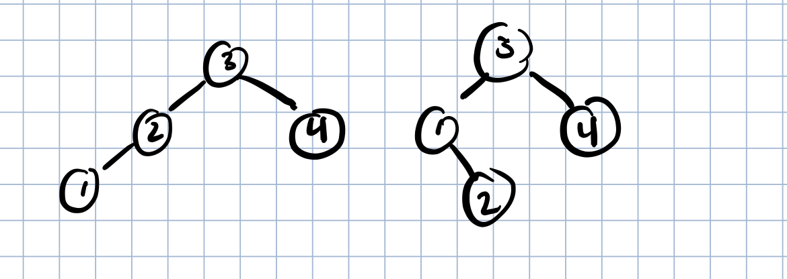

# Divide-and-Conquer

## Merge interval
The merge interval problems are problems where we have to make every partition of the list and find the max over all possible partitions. Usually these problems can be optimized using dynamic programming

### 95. Unique Binary Search Tree II
```
Given an integer n, generate all structurally unique BST's (binary search trees) that store values 1 ... n. Return a list of root nodes
```
Let's pick a number i out of the sequence 1 ..n and use it as the root of the current tree. The iput list 1 to n gets split in two. There are i - 1 elements available for the construction of the left subtree and n - i elements available for the right subtree.


```
node root = new node(i)
root.left = recurse(1,2,...i-1)
root.right = recurse(i+1, i+2, ... n)
```    
But the problem is root.left and root.right can have multiple values. Consider the example of n = 4, with 3 as the root. Then we can
have the following subtrees



So how do we return multiple values? Well we can return a list of root nodes. And for each node in the left and right list, Create a new node i.

```java
public List<TreeNode> generateTrees(int n) {
        if(n == 0) return new ArrayList<>();
        return helper(1, n);
    }
    
    // Helper function
    public List<TreeNode> helper(int left, int right){
        List<TreeNode> res = new ArrayList<>();
        if(left > right){
            res.add(null);
            return res;
        }
        
        for(int i = left; i <= right; i++){
            // Divide
            List<TreeNode> leftSubtree = helper(left, i - 1);
            List<TreeNode> rightSubtree = helper(i + 1, right);
            // solve
            for(TreeNode l : leftSubtree){
                for(TreeNode r : rightSubtree){
                    TreeNode root = new TreeNode(i);
                    root.left = l;
                    root.right = r;
                    res.add(root);
                }
            }
        }
        return res;
    }
```

### 1130 Mimumin cost Tree from From Leaf Values

```
Given an array arr of positive integers, consider all binary trees such that: Each node has either 0 or 2 children; The values of arr correspond to the values of each leaf in an in-order traversal of the tree. Among all possible binary trees considered, return the smallest possible sum of the values of each non-leaf node
```
This is another example of the merge-interval problems where the input list gets divided in two. Consider the input array [1,3,4,5]. We need to partition this array into two segments for the left subtree and the right subtree. We don't know how to partition it so try every partition and return the max over all of them.

All Possible Partitions look like: <br />
[1 | 3,4,5] <br />
[1,3 | 4, 5] <br />
[1,3,4 | 5] <br />

Since the root value is going to be the largest leaf value in the left subtree*the larget value in the right subtree + all non-leaf value then the recurrance relation is 

```
f(i,j) = r * l + f(i, k) + f(k + 1, J) where r is the largest leaf  in the right subtree and l is the largest leaf value in the left subtree for all i <= k <= j
```

```java
class Solution {
    public int mctFromLeafValues(int[] arr) {
        return helper(arr, 0, arr.length - 1, new Integer[arr.length][arr.length]);
    }
    
    public int helper(int[] arr, int left, int right, Integer[][] memo){
        // Basecase we want to return 0 if it is a root because we are not adding anything
        if(left == right) return 0;
        if(memo[left][right] != null) return memo[left][right];
        int minValue = Integer.MAX_VALUE;
        for(int i = left; i < right; i++){
            // Recurse on the left half of i
            int leftSubtree = helper(arr, left, i, memo);
            // Recurse on the right half of i
            int rightSubtree = helper(arr, i + 1, right, memo);
            // Get max leaf on left subtree and right subtree
            int maxLeft = getMaxLeafValue(arr, left, i);
            int maxRight = getMaxLeafValue(arr, i + 1, right);
            
            // We wannt the min over all these values
            minValue = Math.min(maxLeft * maxRight + leftSubtree + rightSubtree , minValue);
                
        }
        return memo[left][right] = minValue;
    }
    
    public int getMaxLeafValue(int[] arr, int left, int right){
        int max =0;
        for(int i = left; i <=right; i++){
            max = Math.max(max, arr[i]);
        }
        return max;
    }
    
    
}
```

